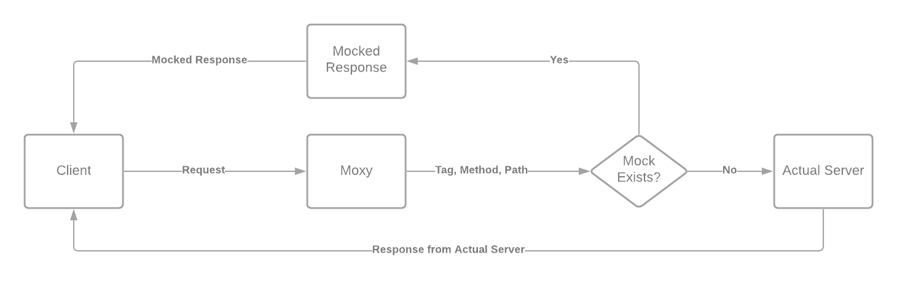

# Moxy

[](https://pkg.go.dev/github.com/sinhashubham95/moxy)
[](https://github.com/sinhashubham95/moxy/releases)
[](https://goreportcard.com/report/github.com/sinhashubham95/moxy)
[](https://coveralls.io/github/sinhashubham95/moxy?branch=master)
[](https://github.com/avelino/awesome-go#server-applications)

Moxy is a simple mocker and proxy application server. Here you can create mock endpoints as well as proxy requests in case no mock exists for the endpoint.

## How it works



## Features

### Small, Pragmatic and Easy to Use

- Dockerized

- Compiled

- Easily configurable via Environment Variables

- Self-contained, does not require Go or any other dependency, just run the binary or the container

### File-based Persistence

- No heavy database involved.

- Saves the mock endpoints in files.

### Security

- TLS can be enabled by providing your own SSL/TLS Certificates.

### Reliability

- Uses [Go Actuator](https://github.com/sinhashubham95/go-actuator)

- Fully Tested, Unit, Functional & Linted & 0 Race Conditions Detected.

### Customizations

- Mock endpoints created are highly customizable.

- Application port can be configured via the environment variable.

- Database file path can be configured via the environment variable.

## Project Versioning

Moxy uses [semantic versioning](http://semver.org/). No API changes will be introduced in the minor and patch version changes. New minor versions might add additional features to the API.

## Getting Started(standalone application)

You can download a pre-compiled package for Linux or MAC OSX [here](https://github.com/sinhashubham95/moxy/releases/latest).

You can also pull the latest docker image for Moxy from [Docker Hub](https://github.com/sinhashubham95/moxy/pkgs/container/moxy).

```shell
docker pull ghcr.io/sinhashubham95/moxy:latest
```

Create an empty directory, change into it and run the following to start Moxy:

```shell
docker run --rm --user $(id -u):$(id -g) -v $PWD:/data -p 9091:9091 sinhashubham95/moxy -host 0.0.0.0
```
